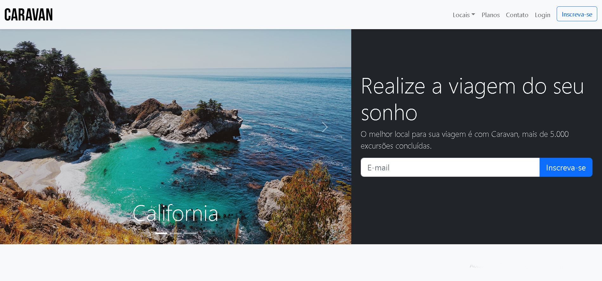

# Caravan

<!---Esses são exemplos. Veja https://shields.io para outras pessoas ou para personalizar este conjunto de escudos. Você pode querer incluir dependências, status do projeto e informações de licença aqui--->

> Homepage criada simulando uma empresa de viagens, neste projeto foi utilizado JavaScript para reatividade, HTML para marcação de texto, Bootstrap para dar estilo.
 

<h4 align="center"><a href="https://caravan-viagens-empresa.netlify.app/">Clique para visitar o projeto</a></h4>

## 📚 Seções

O site é composto por três seções:

- **Excursões:** Increva-se para as excursões;
- **Vantagens:** Nessa seção temos oas vantagens de usar a empresa para viajar;
- **Perguntas:** Apresenta Perguntas frequentes e suas respequitivas respostas;

---

## 🚀  Ferramentas usadas:

O projeto visou o aprendizado de Bootstrap:

- HTML;
- Css;
- JavaScript;
- BootStrap;

---

 

### Ajustes e melhorias

O projeto foi concluído e todas as tarefas finalizadas:

- [x] Tarefa 1
- [x] Tarefa 2
- [x] Tarefa 3
- [x] Tarefa 4
- [x] Tarefa 5

* Compatível `<Windows / Linux / Mac>`.
